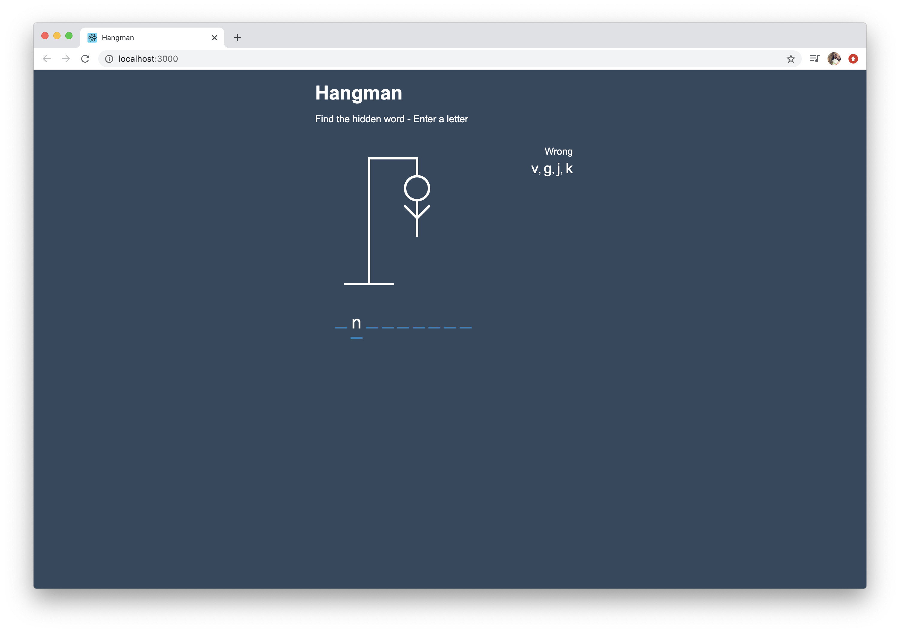

# Hangman ReactJS (in development) 
## Converting the Hooks project into Class Components and explaining the differnece

A Hangman game in React, by following this tutorial: https://www.youtube.com/watch?v=jj0W8tYX_q8

The purpose of this is to practice my React knowledge and do something fun. 

## To run project

```
npm start
```



